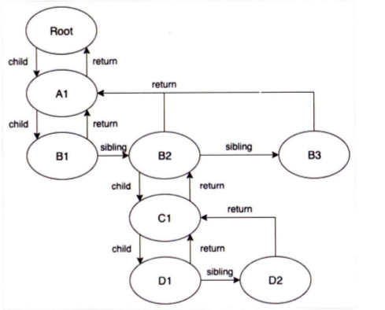
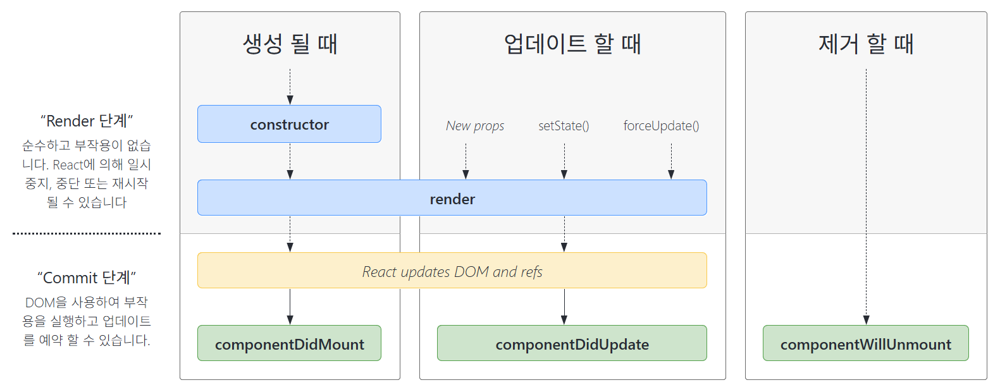

# 2장 리액트 핵심 요소 깊게 살펴보기

이번 장에서는 리액트의 핵심 개념에 대해 깊게 알아봅니다. 그리고 이러한 기능이 JS를 토대로 어떻게 동작하는지 알아봅시다.

# 2.1 JSX란?

JSX(JavaScript XML)는 XML과 유사한 내장형 구문입니다. 리액트에 사용되지만, 리액트에 종속되어 있는 문법이 아니며 필수는 아닙니다.

JSX는 트랜스파일러를 거쳐 JS 런타임이 이해할 수 있는 JS 코드로 변환됩니다.

JSX의 설계 목적은 다양한 트랜스파일러에서 다양한 속성을 가진 트리 구조를 토큰화해 ECMAScript(이하 ES)로 변환하는 데 초점을 두고 있습니다. JSX 내부에 트리 구조로 표현하고 싶은 다양한 것들을 작성해두고, 트랜스파일을 거쳐 ES가 이해할 수 있는 코드로 변경하는 것이 목표입니다. 때문에 HTML, XML 외에도 다른 구문으로 확장할 수 있게끔 하고 있습니다.

## 2.1.1 JSX의 정의

JSX는 `JSXElement`, `JSXAttributes`, `JSXChildren`, `JSXStrings`라는 4가지 컴포넌트를 기반으로 구성돼 있습니다.

### JSXElement

**JSX를 구성하는 가장 기본 요소**로, HTML의 `Element`와 비슷한 역할을 합니다. `JSXElement`가 되기 위한 형태의 조건은 다음과 같습니다.

- `JSXOpeningElement`: `JSXOpeningElement`로 시작했다면 `JSXClosingElement`가 동일한 요소로 같은 단계에 선언돼 있어야 올바른 문법으로 간주됩니다.
  - `<JSXElement JSXAttributes(optional)>`
- `JSXClosingElement`: `JSXOpeningElement`가 종료됐음을 알리는 요소로, 반드시 `JSXOpeningElement`와 쌍으로 사용돼야 합니다.
  - `</JSXElement>`
- `JSXSelfClosingElement`: 요소가 시작되고, 스스로 종료되는 형태입니다. 내부적으로 자식을 가질 수 없는 형태를 의미합니다.
  - `<JSXElement JSXAttributes(optional) />`
- `JSXFragment`: 아무 요소가 없는 형태로, `JSXSelfClosingElement` 형태를 띌 수는 없으며, `</>`는 불가능합니다. 단, `<></>`는 가능합니다.
  - `<>JSXChildren(optional)</>`

리액트에서 컴포넌트를 만들어 사용할 땐, **반드시 컴포넌트 태그명은 대문자로 시작**해야 합니다. HTML 태그명과 컴포넌트 태그명과 구분짓기 위함입니다.

### JSXElementName

`JSXElementName`은 **`JSXElement`의 요소 이름으로 쓸 수 있는 것**을 의미합니다.

- `JSXIdentifier`: JSX 내부에서 사용할 수 있는 식별자로, JS의 식별자 규칙과 동일합니다.
- `JSXNamespacedName`: `JSXIdentifier:JSXIdentifier`의 조합입니다. 서로 다른 식별자를 이어주는 것도 다른 식별자로 취급됩니다. 단, 하나만 묶을 수 있습니다. (두 개 이상 묶을 수 없음)
- `JSXMemberExpression`: `JSXIdentifier.JSXIdentifier`의 조합입니다. `.`을 통해 서로 다른 식별자를 이어주는 것도 다른 식별자로 취급됩니다. `:`와 다르게, 두 개 이상 묶을 수 있습니다. `JSXNamespacedName`과 이어서 사용할 수는 없습니다.

### JSXAttributes

`JSXElement`에 부여할 수 있는 속성을 의미합니다. 단순히 속성을 의미하므로, 모든 경우에서 필수값이 아니며, 존재하지 않아도 에러가 발생하지 않습니다.

- `JSXSpreadAttributes`: JS의 스프레드 연산자와 동일한 역할을 합니다.
  - `{...AssignmentExpression}`: 이 `AssignmentExpression`에는 단순히 객체뿐만이 아니라 JS에서 `AssignmentExpression`으로 취급되는 모든 표현식이 존재할 수 있습니다.
- `JSXAttribute`: 속성을 나타내는 키와 값으로 짝을 이루어 표현합니다. 키는 `JSXAttributeName`, 값은 `JSXAttributeValue`로 불립니다.
  - `JSXAttributeName`: 속성의 키 값이며, `JSXIdentifier`와 `JSXNamespacedName`이 가능합니다.
  - `JSXAttributeValue`: 속성의 키에 할당할 수 있는 값이며, `""`로 구성된 문자열, `''`로 구성된 문자열, `{ AssignmentExpression }`, `JSXElement`, `JSXFragment` 중 하나여야 합니다.

> `{ AssignmentExpression }`: JS의 `AssignmentExpression`을 의미하며, 이는 JS에서 값을 할당할 때 쓰는 표현식입니다.

### JSXChildren

`JSXElement`의 자식 값을 의미합니다. JSX의 트리 구조의 "자식"에 해당합니다.

- `JSXChild`: `JSXChildren`의 기본 단위입니다. 0개 이상 가질 수 있습니다.
  - `JSXText`: `{`, `<`, `>`, `}`를 제외한 문자열이며, 이는 다른 JSX 문법과 혼동을 줄 수 있기 때문입니다.
  - `JSXElement`: 값으로 다른 JSX 요소가 들어갈 수 있습니다.
  - `JSXFragment`: 값으로 `JSXFragment`가 들어갈 수 있습니다.
  - `{ JSXChildExpression (optional) }`: `JSXChildExpression`은 JS의 `AssignmentExpression`을 의미하며, 다음과 같은 코드도 JSX 표현식으로 가능합니다.
    - `...return <>{(() => 'foo')()}</>`

### JSXStrings

`JSXAttributeValue`와 `JSText`는 HTML과 JSX 사이에 복사 붙여넣기를 쉽게 할 수 있도록 설계돼 있습니다. HTML에서 사용 가능한 문자열 모두 `JSXStrings`에서도 가능합니다. 이는 HTML 내용을 쉽게 JSX로 옮길 수 있도록 의도적으로 설계된 것입니다. 여기서 문자열은 `""` 또는 `''`로 구성된 문자열 혹은 `JSXText`를 의미합니다.

때문에 `\`로 시작하는 이스케이프 문자 형태소는 HTML에서 사용할 때 제약이 없지만, JS에서는 `\\`로 표현하는 등 차이점이 발생합니다. 이는 HTML과 JSX 사이에 복사/붙여넣기를 쉽게 하기 위함입니다.

## 2.1.2 JSX 예제

```jsx
// 하나의 요소로 구성된 가장 단순한 형태
const ComponentA = <A>안녕하세요.</A>;

// 자식이 없이 SelfClosingTag로 닫혀있는 형태도 가능하다.
const ComponentB = <A />;

// 옵션을 { } 와 전개 연산자로 넣을 수 있다.
const ComponentC = <A {...{ required: true }} />;

// 옵션명만 넣어도 가능하다.
const ComponentD = <A required />;

// 옵션명과 속성을 넣을 수 있다.
const ComponentE = <A required={false} />;

const ComponentF = (
  <A>
    {/* 문자열은 쌍따옴표및 홀따옴표 모두 가능하다. */}
    <B text="리액트" />
  </A>
);

const ComponentG = (
  <A>
    {/* 옵션의 값으로 JSXElement를 넣는 것 또한 올바른 문법이다. */}
    <B optionalChildren={<>안녕하세요.</>} />
  </A>
);

const ComponentH = (
  <A>
    {/* 여러개의 자식도 포함할 수 있다. */}
    안녕하세요
    <B text="리액트" />
  </A>
);
```

## 2.1.3 JSX는 어떻게 자바스크립트에서 변환될까?

리액트에서 JSX를 변환하는 플러그인은 `@babel/plugin-trasform-react-jsx`입니다. 이 플러그인은 JSX 구문을 JS가 이해할 수 있는 형태로 변환합니다.

JSX는 JS로 변환될 때, 반환값이 `React.createElement` 함수로 변환됩니다.

```jsx
const ComponentA = <A required={true}>Hello World</A>;
const ComponentB = <B>Hello World</B>;
const ComponentC = (
  <div>
    <span>Hello World</span>
  </div>
);
```

```js
"use strict";
var ComponentA = React.createElement(
  A,
  {
    required: true,
  },
  "Hello World"
);
var ComponentB = React.createElement(React.Fragment, null, "Hello World");
var ComponentC = React.createElement(
  "div",
  null,
  React.createElement("span", null, "hello world")
);
```

1. `JSXElement`를 첫 번째 인수로 선언해 요소를 정의한다.
2. 옵셔널인 `JSXChildren`, `JSXAttributes`, `JSXStrings`는 이후 인수로 넘겨 처리한다.

JSX가 JS로 변환되는 방법을 알고 있다면, 다른 `JSXElement`를 렌더링할 때, `JSXElement`만 다르고 나머지 인수가 완전히 동일한 상황에서 중복 코드를 최소화할 수 있습니다.

```jsx
// props의 여부에 따라 children만 달라지는 경우, 불필요한 코드 중복이 일어난다.
function TextOrHeading({
  isHeading,
  children,
}: PropsWithChildren<{ isHeading: boolean }>) {
  return isHeading ? (
    <h1 className="text">{children}</h1>
  ) : (
    <span className="text">{children}</span>
  );
}

// JSX가 변환되는 특성을 활용해 중복 코드를 최소화
function TextOrHeading({
  isHeading,
  children,
}: PropsWithChildren<{ isHeading: boolean }>) {
  return createElement(
    isHeading ? "h1" : "span",
    { className: "text" },
    children
  );
}
```

### 2.1.4 정리

위는 JSX 공식 문서에 있는 JSX의 스펙으로, JSX 문법에 있지만 `JSXNamespacedName`, `JSXMemberExpression`과 같이 리액트가 사용하지 않는 생소한 것들도 있습니다.

JSX는 HTML과 같이 손쉽게 컴포넌트를 작성할 수 있다는 이점이 있지만, JS 코드 내부에 HTML 문법이 혼용되므로 JSX 내부의 JS 문법이 많아지면 복잡성이 커지며 코드의 가독성을 해치므로 주의해야 할 필요도 있습니다.

리액트 내부에서 JSX가 변환되는 과정과 결과물을 알고 있다면 리액트뿐만아니라 JSX 기반의 다른 라이브러리(Preact, SolidJS, Nano JSX 등)를 사용하는 데 도움이 될 것입니다.

# 2.2 가상 DOM과 리액트 파이버

리액트의 특징 중 하나인 가상 DOM이 무엇인지, 실제 DOM에 비해 어떤 이점이 있는지, 가상 DOM을 다룰 때 주의할 점에 대해 알아봅시다.

## 2.2.1 DOM과 브러우저 렌더링 과정

리액트에 대해 더욱 중점적으로 다루기 위해, DOM과 브라우저 렌더링 과정에 대한 설명은 생략하겠습니다.

## 2.2.2 가상 DOM의 탄생 배경

브라우저가 웹페이지를 렌더링하는 과정은 매우 복잡하고 많은 비용이 듭니다. 최근에는 렌더링 이후에도 사용자의 인터랙션에 따라 웹페이지가 변경되기도 합니다. 리페인팅만 발생한다면 비교적 빠르게 처리할 수 있지만, 특정 요소의 위치와 크기가 재계산되면 레이아웃이 일어나며 리페인팅까지 발생하기 대문에 더 많은 비용이 듭니다. 또한 DOM의 변경이 일어나면 하위 자식 요소도 덩달아 변경돼야 하기 때문에 더 많은 비용을 브라우저와 사용자가 지불하게 됩니다.

이러한 작업은 SPA(Single Page Application)에서 더욱 많아집니다. HTML을 새로 받지 않고, 지속적으로 특정 요소를 조작하는 작업이 빈번하게 일어나므로 DOM을 관리하는 과정에서 부담해야 할 비용이 커지게 됩니다.

대부분의 개발자의 경우, 인터랙션에 모든 DOM의 변경보다는 결과적으로 만들어지는 DOM 결과물 하나만 궁금할 것입니다. 인터랙션에 따른 DOM 결과물 하나만 간편하게 제공하는 것은 브라우저뿐만 아니라 개발자에게도 유용합니다.

이러한 흐름에서 가상 DOM이 탄생했습니다. **가상 DOM은 웹페이지가 표시해야 할 DOM을 일단 메모리에 저장 후, 리액트(`react-dom`)가 실제 변경에 대한 준비가 완료됐을 때 실제 브라우저의 DOM에 반영**합니다.

가상 DOM을 이용한 방식이 일반적인 DOM을 관리하는 브라우저보다 무조건 빠르지는 않지만, 대부분의 상황에서 웬만한 애플리케이션을 만들 수 있을 정도의 빠름을 제공합니다.

## 2.2 가상 DOM을 위한 아키텍처, 리액트 파이버

### 리액트 파이버란?

리액트 파이버는 리액트에서 관리하는 평범한 JS 객체입니다. 파이버는 파이버 재조정자(fiber reconciler)가 관리하며, 가상 DOM과 실제 DOM을 비교해 변경 사항을 수집하며 둘의 차이가 존재하면 변경에 관련된 정보를 가지고 있는 파이버를 기준으로 화면에 렌더링을 요청하는 역할을 합니다.

> 재조정(reconciliation): 리액트에서 어떤 부분을 새롭게 렌더링해야 하는지 가상 DOM과 실제 DOM을 비교하는 작업(알고리즘)

리액트 파이버는 웹 앱의 애니메이션, 레이아웃, 사용자 인터랙션에 올바른 결과물을 만드는 반응성 문제를 해결해야 합니다. 이를 위해서,

- 작업을 작은 단위로 분할, 우선순위 부여
- 작업을 일시 중지하고 나중에 다시 시작
- 이전 작업을 재사용하거나 필요치 않은 경우 폐기

하는 일을 합니다. 이 모든 과정은 비동기로 일어납니다. 과거 리액트의 조정 알고리즘은 스택 알고리즘이었습니다. 과거에는 이 하나의 스택에 렌더링에 필요한 작업들이 쌓이면, 빌 때까지 동기적으로 작업이 이루어져 비효율적이었습니다. 이를 타파하기 위해 스택 조정자 대신 파이버라는 개념을 탄생시킵니다.

파이버는 하나의 작업 단위로 구성됩니다. 리액트는 작업 단위를 하나씩 처리하고 `finishedWork()`라는 작업으로 마무리합니다. 그리고 이 작업을 커밋해 실제 브라우저 DOM에 반영합니다. 이러한 단계는 두 단계로 나뉩니다.

1. 렌더 단계: 리액트는 사용자에게 노출되지 않는 모든 비동기 작업을 수행한다. 이 과정에서 작업의 우선순위를 지정하거나 중시키키고 버리는 작업이 일어난다.
2. 커밋 단계: `commitWork()`로 실제 DOM에 반영한다. 이 과정에서는 앞과 다르게 동기식으로 일어나고 중단될 수도 없다.

실제 리액트 코드의 파이버는 어떻게 구현돼 있을까요? (리액트 18.2.0 기준)

리액트의 파이버 객체는 다음과 같습니다.

```js
function FiberNode(tag, pendingProps, key, mode) {
  // Instance
  this.tag = tag;
  this.key = key;
  this.elementType = null;
  this.type = null;
  this.stateNode = null;

  // Fiber
  this.return = null;
  this.child = null;
  this.sibling = null;
  this.index = 0;
  this.ref = null;
  this.refCleanup = null;

  this.pendingProps = pendingProps;
  this.memoizedProps = null;
  this.updateQueue = null;
  this.memoizedState = null;
  this.dependencies = null;

  this.mode = mode;

  // Effects
  this.flags = NoFlags;
  this.subtreeFlags = NoFlags;
  this.deletions = null;

  this.lanes = NoLanes;
  this.childLanes = NoLanes;

  this.alternate = null;

  // 이하 프로파일러, __DEV__ 코드는 생략
}
```

리액트 요소와의 중요한 차이점은 리액트 요소는 렌더링이 발생할 때마다 새로 생성되지만 파이버는 가급적 재사용됩니다. 파이버는 컴포넌트 최초 마운트 시점에 생성되어 이후에는 가급적으로 재사용됩니다.

파이버를 생성하는 다양한 함수는 다음과 같습니다.

```js
var createFiber = function (tag, pendingProps, key, mode) {
  return new FiberNode(tag, pendingProps, key, mode);
};

// 생략...

function createFiberFromElement(element, mode, lanes) {
  var owner = null;
  {
    owner = element._owner;
  }

  var type = element.type;
  var key = element.key;
  var pendingProps = element.props;
  var fiber = createFiberFromTypeAndProps(
    type,
    key,
    pendingProps,
    owner,
    mode,
    lanes
  );

  {
    fiber._debugSource = element._source;
    fiber._debugOwner = element._owner;
  }

  return fiber;
}

function createFiberFromFragment(elements, mode, lanes, key) {
  var fiber = createFiber(Fragment, elements, key, mode);
  fiber.lanes = lanes;
  return fiber;
}
```

**하나의 `element`에 하나의 파이버가 생성**됩니다.

- `tag`: 파이버가 하나의 `element`에 매칭되는 정보를 가집니다. 이는 리액트 컴포넌트, HTML의 DOM 노드, 혹은 다른 어떤 것이 될 수 있습니다. 이는 아래에 나열된 값들이 됩니다.

  ```JS
  var FunctionComponent = 0;
  var ClassComponent = 1;
  var IndeterminateComponent = 2;
  var HostRoot = 3;
  var HostPortal = 4;
  var HostComponent = 5; // 웹 div와 같은 요소를 의미한다.
  var HostText = 6;
  var Fragment = 7;
  var Mode = 8;
  var ContextConsumer = 9;
  var ContextProvider = 10;
  var ForwardRef = 11;
  var Profiler = 12;
  var SuspenseComponent = 13;
  var MemoComponent = 14;
  var SimpleMemoComponent = 15;
  var LazyComponent = 16;
  var IncompleteClassComponent = 17;
  var DehydratedFragment = 18;
  var SuspenseListComponent = 19;
  var ScopeComponent = 21;
  var OffscreenComponent = 22;
  var LegacyHiddenComponent = 23;
  var CacheComponent = 24;
  var TracingMarkerComponent = 25;
  ```

- `stateNode`: 파이버 자체의 참조 정보를 가집니다. 이 참조로 리액트가 파이버에 관련된 상태에 접근할 수 있습니다.
- `child`, `sibling`, `return`: 파이버 간의 관계 개념을 나타냅니다. 파이버 역시 트리 구조를 갖습니다. 리액트 컴포넌트 트리와 다르게 `children`이 없습니다. 즉, 하나의 `child`만 존재합니다. 파이버의 자식은 항상 파이버 자식 중 첫 번째만을 가리킵니다. 나머지는 `sibling`으로 구성됩니다. `return`은 부모 파이버를 의미합니다. 모든 자식 파이버는 부모 파이버를 `return`으로 갖습니다.
- `index`: 여러 `sibling` 사이에서 자신의 위치가 몇 번째인지 숫자로 표현합니다.
- `pendingProps`: 아직 작업을 처리하지 못한 props들을 의미합니다.
- `memoizedProps`: `pendingProps`를 기준으로 완료된 `pendingProps`를 `memoizedProps`로 저장해 관리합니다.
- `updatedQueue`: 상태 업데이트, 콜백 함수, DOM 업데이트 등 필요한 작업을 담아두는 큐입니다.

  ```ts
  type UpdateQueue = {
    first: Update | null;
    last: Update | null;
    hasForceUpdate: boolean;
    callbackList: null | Array<Callback>; // setState로 넘긴 콜백 목록
  };
  ```

- `memoizedState`: 함수 컴포넌트의 훅 목록이 저장됩니다. `useState`뿐만 아니라 모든 훅 리스트가 저장됩니다.
- `alternate`: 이어질 내용의 또 다른 파이버 트리인, 반대편 트리 파이버를 가리킵니다.

파이버는 state가 변경되거나 생명주기 메서드가 실행되거나 DOM의 변경이 필요한 시점 등에 실행됩니다. 이러한 작업은 직접 바로 처리하거나 스케줄링되기도 하며 유연하게 처리됩니다.

리액트 개발 팀에 의하면 리액트는 가상 DOM이 아닌 Value UI, 즉 값을 가지는 UI를 관리하는 라이브러리라고 말한 바 있습니다. 리액트의 핵심 원칙은 UI를 문자열, 숫자, 배열과 같은 값으로 관리한다는 것입니다. 변수에 UI 값을 보관하여 리액트의 JS 코드 흐름에 따라 이를 관리하고, 표현하는 것이 리액트입니다.

### 리액트 파이버 트리

파이버 트리는 리액트 내부에 두 개 존재합니다. 하나는 현재 모습을 담은 파이버 트리, 다른 하나는 작업 중인 상태를 나타내는 `workInProgress` 트리입니다. 파이버의 작업이 끝나면 리액트는 단순히 포인터만 변경해 `workInProgress` 트리를 현재 트리로 바꿉니다. 이 기술을 **더블 버퍼링**이라고 합니다.

> 더블 버퍼링: 컴퓨터 그래픽 분야에서 사용하는 용어로, 보이지 않는 곳에 다음 그려야 할 그림을 미리 그려둔 후, 완성되면 현재 상태를 새로운 그림으로 바꾸는 기법

현재 UI 렌더링 트리인 `current`를 기준으로 업데이트가 발생하면 파이버는 리액트에서 새로 받은 데이터로 새로운 `workInProgress` 트리를 빌드합니다. 빌드가 끝나면 다음 렌더링에 해당 트리를 사용합니다. 최종적으로 반영이 완료되면 `current`가 이 `workInProgress`로 변경됩니다.

### 파이버의 작업 순서

파이버의 작동 흐름을 살펴보겠습니다.

먼저 일반적인 파이버 노드의 생성 흐름은 다음과 같습니다.

1. 리액트가 `beginWork()` 함수를 실행해 파이버 작업을 수행하며, 더 이상 자식이 없는 파이버를 만날 때까지 트리 형식으로 시작됩니다.
2. 1번 작업이 끝나면 `completeWork()` 함수를 실행해 파이버 작업을 완료합니다.
3. 형제가 있다면 형제로 넘어갑니다.
4. 2, 3번이 모두 끝나면 `return`으로 돌아가 자신의 작업이 완료됐음을 알립니다.



`setState` 등으로 업데이트가 발생하면, `workInProgress` 트리를 다시 빌드합니다. 여기서 **가급적 새로운 파이버를 생성하지 않으며, 기존에 있는 객체를 재활용하기 위해 내부 속성값만 초기화하거나 바꾸는 형태로 트리를 업데이트**합니다.

과거에는 트리 업데이트 과정이 재귀적으로 하나의 트리를 순회해 새로운 트리를 만드는 작업이 동기로 진행되어 중단될 수 없었습니다. 그러나 현재는 우선순위에 따라 현재 작업을 일시 중단하거나, 새로 만들거나, 폐기하기도 합니다. 리액트는 이러한 작업을 파이버 단위로 나눠서 수행합니다. 애니메이션이나 사용자의 입력은 우선순위가 높은 작업으로 분리하거나, 목록을 렌더링하는 등의 작업은 우선순위가 낮은 작업으로 분리해 최적의 순위로 작업을 완료할 수 있게끔 합니다.

## 2.2.5 정리

개발자가 직접 DOM을 수동으로 변경할 때 어떤 값이 바뀌었는지, 또 그 값에 따라 어떤 값이 변경됐고 이와 관련된 것들에 대해 파악하기란 어려운 일입니다. 이를 리액트 내부의 파이버와 재조정자가 내부 알고리즘을 통해 관리해줌으로써 대규모 웹 앱을 효율적으로 유지보수하고 관리할 수 있게 되었습니다.

가상 DOM과 리액트의 핵심은 브라우저의 DOM을 빠르게 반영하는 것이 아닌, 값으로 UI를 표현하는 것입니다. UI를 JS의 문자열, 배열 등과 마찬가지로 값으로 관리하고 이러한 흐름을 효율적으로 관리하기 위한 메커니즘이 바로 리액트의 핵심입니다.

# 2.3 클래스 컴포넌트와 함수 컴포넌트

함수 컴포넌트는 리액트 0.14 버전부터 만들어진 역사가 깊은 컴포넌트 선언 방식입니다. 이때 함수 컴포넌트는 별도의 상태 없이 단순히 정적으로 요소를 렌더링하기 위한 무상태 함수 컴포넌트(stateless funtional component)였습니다.

함수 컴포넌트는 당시 생명주기 메서드나 상태 없이 `render`만 하는 경우 제한적으로 사용되다 16.8 버전에서 훅이 나온 뒤로 각광을 받기 시작했습니다.

훅이 생명주기 메서드와 비슷한 작업을 흉내 낼 수 있게되자 보일러플레이트가 발생하는 클래스 컴포넌트보다 함수 컴포넌트를 더 많이 사용하며 과도기에 많은 혼란이 발생했습니다.

두 컴포넌트의 차이점을 알아보고, 각 컴포넌트 작성 시 고려해야 할 사항에 대해 알아봅니다.

## 2.3.1 클래스 컴포넌트

현재는 많이 쓰이지 않지만, 오래된 코드의 유지보수, 오래전에 개발된 라이브러리 등을 사용할 때 클래스 컴포넌트를 마주치게 됩니다. 때문에 클래스 컴포넌트의 구조에 대한 이해가 필요합니다.

다음은 클래스 컴포넌트의 기본 구조입니다.

```js
import React from "react";

class SampleComponent extends React.Component {
  redner() {
    return <h2>Sample Component</h2>;
  }
}
```

`extends` 구문에는 `React.Component`와 `React.PureComponent`를 넣을 수 있는데, 차이점은 `shouldComponentUpdate`를 다루는 데 있습니다.

props나 state, 메서드는 다음과 같이 정의합니다.

```jsx
import React from 'react'

// props 타입을 선언한다.
interface SampleProps {
  required?: boolean
  text: string
}

// state 타입을 선언한다.
interface SampleState {
  count: number
  isLimited?: boolean
}

// Component에 제네릭으로 props, state를 순서대로 넣어준다.
class SampleComponent extends React.Component<SampleProps, SampleState> {
  // constructor에서 props를 넘겨주고, state의 기본값을 설정한다.
  private constructor(props: SampleProps) {
    super(props)
    this.state = {
      count: 0,
      isLimited: false,
    }
  }

  // 렌더 내부에서 쓰일 함수를 선언한다.
  private handleClick = () => {
    const newValue = this.state.count + 1
    this.setState({ count: newValue, isLimited: newValue >= 10 })
  }

  // render에서 이 컴포넌트가 렌더링할 내용을 정의한다.
  public render() {
    // props와 state 값을 this, 즉 해당 클래스에서 꺼낸다.
    const {
      props: { required, text },
      state: { count, isLimited },
    } = this

    return (
      <h2>
        Sample Component
        <div>{required ? '필수' : '필수아님'}</div>
        <div>문자: {text}</div>
        <div>count: {count}</div>
        <button onClick={this.handleClick} disabled={isLimited}>
          증가
        </button>
      </h2>
    )
  }
}

export default SampleComponent
```

- `constructor()`: 생성자 함수가 있으면 컴포넌트 초기화 시점에 호출된다. 여기서는 컴포넌트의 state를 초기화할 수 있다. `super()`는 컴포넌트를 만들면서 상속받은 상위 컴포넌트, `React.Component`의 생성자 함수를 먼저 호출해 필요한 상위 컴포넌트에 접근할 수 있게 도와준다.

  - `constructor`가 없이도 state를 초기화할 수 있다.

  ```jsx
  import { Component } from "react";

  class SampleComponent2 extends Component {
    state = {
      count: 1,
    };

    render() {
      const {
        state: { count },
      } = this;

      return <div>{count}</div>;
    }
  }
  ```

  ES2022에 추가된 클래스 필드 문법을 사용해서 별도의 초기화 과정없이 클래스 내부에 필드를 선언할 수 있게 도와준다. 비교적 최근 문법이므로 트랜스파일이 필요할 수도 있다.

- props: 컴포넌트에 특정 속성을 전달하는 용도로 쓰인다.
- state: 클래스 컴포넌트 내부에서 관리하는 값을 의미한다. 이 값은 항상 객체여야만 한다. 이 값에 변화가 있을 때마다 리렌더링이 발생한다.
- 메서드: 렌더링 함수 내부에서 사용되는 함수로 보통 DOM에서 발생하는 이벤트와 함께 사용된다. 만드는 방법은 크게 세 가지로 나뉜다.

  1.  `constructor`에서 `bind` 함수를 통한 `this` 바인딩: 생성자 함수가 아닌 일반 함수로 호출 시 `this`에 전역 객체가 바인딩되기 때문에 명시적으로 바인딩해줄 필요가 있다.

  ```ts
  private contructor(props: Props) {
      ...
      this.handleClick = this.handleClick.bind(this);
  }
  ```

  2. 화살표 함수로 선언: 화살표 함수로 선언 시, 작성 시점에 `this`가 상위 스코프로 결정된다.
  3. 렌더링 함수 내부에서 함수를 새롭게 만들어 전달: 매번 렌더링할 때마다 새로운 함수를 생성하므로 최적화를 수행하기 어려우므로 지양하는 것이 좋다.

  ```jsx
  <button onClick={() => this.handleClick()}>증가</button>
  ```

### 클래스 컴포넌트의 생명주기 메서드

클래스 컴포넌트의 많은 코드는 생명주기 메서드에 의존합니다. 리액트 17로 넘어오면서 안전하지 않다고 선언된 메서드에 대해서는 다루지 않습니다.

생명주기 메서드의 실행 시점은 다음과 같습니다.

- 마운트(mount): 컴포넌트가 마운트(생성)되는 시점
- 업데이트(update): 이미 생성된 컴포넌트의 내용이 변경(업데이트)되는 시점
- 언마운트(unmount): 컴포넌트가 더 이상 존재하지 않는 시점

### render()

컴포넌트 클래스의 유일한 필수 값입니다. UI를 렌더링하기 위해 쓰이며, 마운트와 업데이트 과정에서 실행됩니다.

`render()` 함수는 부수 효과가 일어나서는 안 됩니다. 따라서 **내부에서 state를 직접 업데이트하는 `this.setState`를 호출해서는 안 됩니다.** state를 변경하는 건 컴포넌트의 메서드나 다른 생명주기 메서드 내부에서 발생해야 합니다.

부수 효과를 방지하기 위해, 항상 최대한 간결하고 깔끔하게 작성해야 합니다.

### componentDidMount()

컴포넌트가 마운트되고 준비되면 호출되는 생명주기 메서드로, 준비되는 즉시 실행됩니다. `this.setState()`로 `state` 값을 변경할 수 있습니다. `state`가 변경되면서 그 즉시 다시 한번 렌더링을 시도합니다.

성능 문제를 일으킬 수 있어 주의해야 합니다. 일반적으로 `state`를 다루는 건 생성자 함수에서 하는 것이 좋습니다. 생성자 함수에서 불가능한 것, API 호출 후 업데이트, DOM에 의존적인 작업(이벤트 리스너 추가) 등을 하기 위한 것이 아니면 주의해서 사용해야 합니다.

### componentDidUpdate()

컴포넌트 업데이트가 일어난 직후 실행됩니다. 일반적으로 state나 props의 변화에 따라 DOM을 업데이트하는 등에 사용됩니다. `this.setState`를 사용할 수 있으나 적절한 조건문을 사용하지 않으면 계속해서 호출되는 문제가 발생할 수 있습니다.

### componentWillUnmount()

컴포넌트가 언마운트되거나 더 이상 사용되지 않기 직전에 호출됩니다. 메모리 누수나 불필요한 작업을 막기 위한 클린업 함수를 호출하기 위해 사용됩니다. 내부에서 `this.setState`를 호출할 수 없습니다.

이벤트 리스너를 제거하거나, API 호출을 취소하거나, 타이머를 제거하는 등의 작업을 하는 데 사용합니다.

### shouldComponentUpdate()

state나 props의 변경으로 컴포넌트가 리렌더링되는 것을 막기 위해 사용합니다. 컴포넌트에 영향을 받지 않는 변화에 대해 정의할 수 있습니다.

state의 변화에 따라 컴포넌트가 리렌더링되는 것이 자연스러운 일이므로 해당 메서드를 사용할 땐 특정 성능 최적화 상황에서만 고려해야 합니다.

`Component`와 `PureComponent`의 차이점이 해당 생명주기 메서드를 다루는 데 있습니다.

- `Componenet`: state가 변경되는 대로 렌더링이 일어난다.
- `PureComponent`: state 값에 대해 얕은 비교를 수행해 결과가 다를 때만 렌더링을 수행한다.

만약 `setState`를 수행한 state 값이 이전과 얕은 비교 결과가 같다면, `PureComponent`는 리렌더링되지 않습니다.

컴포넌트가 얕은 비교를 했을 때 일치하지 않는 일이 잦다면, `PureComponent`의 효과가 미미하기 때문에, `PureComponent`가 모든 경우에 좋지는 않습니다.

### static getDerivedStateFromProps()

가장 최근에 도입된 메서드 중 하나로, 이전에 존재했었던 `componentWillReceiveProps`를 대체하는 메서드입니다. props를 바탕으로 현재의 state를 변경하고 싶을 때 사용합니다. `render()`를 호출하기 직전에 호출되며 반환되는 객체가 모두 state에 들어가게 됩니다. `null` 반환 시 아무 일도 일어나지 않습니다.

모든 `render()` 실행 시에 실행되므로 주의해야 합니다.

해당 메서드를 포함한 뒤에 소개되는 메서드들은 아직 훅으로 구현되지 않았습니다. 이후 동일한 작업을 할 수 있는 훅이 추가될 것이라 언급했으나 구체적인 스펙, 일정이 공개되지 않았습니다.

### getSnapShotBeforeUpadte()

최근에 도입된 메서드로 `componentWillUpdate`를 대체하는 메서드입니다. DOM에 렌더링되기 전의 작업을 처리하고 싶을 때 사용합니다. DOM 업데이트 직전에 호출되며 반환 값이 `componentDidUpdate`로 전달됩니다.



### getDerivedStateFromError()

에러 상황에서 실행되는 메서드입니다. 자식 컴포넌트에서 에러가 발생하면 호출되는 에러 메서드입니다. 에러 처리 로직을 구현하는 데 사용합니다. 특히, **에러 바운더리를 구현하는 데 사용**됩니다.

다음은 에러 바운더리 구현 예시입니다.

```jsx
import React, { PropsWithChildren } from "react";

type Props = PropsWithChildren<{}>;

type State = {
  hasError: boolean,
  errorMessage: string,
};

export default class ErrorBoundary extends React.Component<Props, State> {
  constructor(props: Props) {
    super(props);
    this.state = {
      hasError: false,
      errorMessage: "",
    };
  }

  static getDerivedStateFromError(error: Error) {
    return {
      hasError: true,
      errorMessage: error.toString(),
    };
  }

  render() {
    // 에러가 발생했을 경우에 렌더링할 JSX
    if (this.state.hasError) {
      return (
        <div>
          <h1>에러가 발생했습니다.</h1>
          <p>{this.state.errorMessage}</p>
        </div>
      );
    }

    // 일반적인 상황의 JSX
    return this.props.children;
  }
}
```

`static` 메서드로, `error`를 인수로 받습니다. 하위 컴포넌트가 발생한 에러를 캐치합니다. 자식 컴포넌트를 렌더링하기 위해 반드시 미리 정의한 state 값을 반환해야 합니다. state를 반환하는 것 외의 모든 부수 효과를 발생시키면 안 됩니다. 에러 로깅 같은 작업은 `componentDidCatch` 메서드를 사용할 수 있습니다.

### componentDidCatch()

자식 컴포넌트에서 에러가 발생하면 실행되며, `getDerivedStateFromError`에서 에러를 캐치한 뒤 state를 반환한 이후 실행됩니다.

위의 에러 바운더리 컴포넌트의 `getDerivedStateFromError` 바로 밑에 다음과 같이 선언해서 사용할 수 있습니다.

```js
componentDidCatch(error: Error, info: ErrorInfo) {
    console.log(error);
    console.log(info);
}
```

`error` 객체와, 어떤 컴포넌트가 에러를 발생시켰는지 정보를 가진 `info`를 인수로 받습니다.

커밋 단계에서 실행되며, 에러 발생 시 로깅하는 용도로 사용할 수 있습니다.

> `componentDidCatch`는 개발 모드와 프로덕션 모드에서 다르게 동작합니다. 개발 모드에서는 에러 발생 시 `window`까지 전파되지만, 프로덕션 모드에서는 `componentDidCatch`로 잡히지 않은 에러만 `window`까지 전파됩니다.

### 클래스 컴포넌트의 한계

- 데이터의 흐름을 추적하기 어렵다: state의 흐름을 추적하기 어렵고, 서로 다른 여러 메서드에서 state의 업데이트가 일어난다. 또한, 메서드 선언 순서가 강제돼 있지 않아 가독성이 떨어진다.
- 애플리케이션 내부 로직의 재사용이 어렵다: 공통 로직이 많아질 수록, 이를 감싸는 고차 컴포넌트(HOC) 내지는 props가 많아져 래퍼 지옥(wrapper hell)에 빠질 수 있다. 컴포넌트를 상속한다고 해도 상속되고 있는 클래스의 흐름을 쫓아야 하기에 복잡도가 증가한다.
- 기능이 많아질 수록 컴포넌트 크기가 커진다: 로직이 많아질 수록, 내부 데이터 흐름이 복잡해져 생명주기 메서드 사용이 잦아지면, 컴포넌트 크기가 기하급수적으로 커지는 문제가 발생한다.
- 클래스는 함수에 비해 상대적으로 어렵다: 클래스의 사용이 익숙하지 않은 기존의 JS 개발자가 사용하기 까다롭다.
- 코드 크기를 최적화하기 어렵다: 클래스 컴포넌트는 사용되지 않는 메서드가 최소화되지 않는 등, 번들 크기를 줄이는 데 불리하다.
- 핫 리로딩에 상대적으로 불리하다: 핫 리로딩은 코드 변경 사항에 대해 앱을 다시 시작하지 않고 변경된 코드만 업데이트해 변경 사항을 빠르게 적용하는 기법이다.

  클래스 컴포넌트는 최초 렌더링시 `instance`를 생성하고 그 내부에서 state 값을 관리하는데, 이 `instance` 내부의 `render`를 수정하게 되면 이를 반영할 수 있는 방법은 오직 `instance`를 새로 만드는 것 뿐이다. 새로 생성되면 값은 당연히 초기화될 수 밖에 없다.

  함수 컴포넌트는 state 값을 클로저에서 저장하므로 다시 실행돼도 state에 대한 정보를 잃지 않는다.

## 2.3.2 함수 컴포넌트

16.8 버전 이전에는 단순히 무상태 컴포넌트를 구현하기 위한 수단이었지만, 훅의 등장으로 함수 컴포넌트가 각광 받게 되었습니다.

코드가 훨씬 간결해지며, `this` 바인딩을 사용하지 않아도 props와 state에 접근할 수 있게 되었으며, state를 객체가 아닌 원시값으로 관리하여 사용하기 편해졌습니다.

## 2.2.3 함수 컴포넌트 vs. 클래스 컴포넌트

두 컴포넌트의 차이점을 비교하며, 어떤 컴포넌트를 사용하는 것이 적절할 지 생각해 봅시다.

### 생명주기 메서드의 부재

함수 컴포넌트에서는 생명주기 메서드를 사용할 수 없습니다. 생명주기 메서드는 `React.Component`의 메서드이기 때문입니다. 함수 컴포넌트는 props를 받아 단순히 리액트 요소만 반환하는 함수이며, 클래스 컴포넌트는 `render` 메서드가 존재하는 `React.Component`를 상속받아 구현하는 JS 클래스입니다.

함수 컴포넌트에서 `useEffect` 훅을 사용해 `componentDidMount`, `componentDidUpdate`, `componentWillUnmount`를 비슷하게 구현할 수 있지만, 서로 상호 호환되지는 않습니다. `useEffect`는 생명주기를 위한 훅이 아닙니다.

### 함수 컴포넌트와 렌더링된 값

함수 컴포넌트는 렌더링된 값을 고정하지만, 클래스 컴포넌트는 그렇지 않습니다.

클래스 컴포넌트는 `this`에 바인딩된 props를 사용하지만, 함수 컴포넌트는 props를 인수로 받습니다. 때문에 props를 받는 컴포넌트에서는 그 값을 변경할 수 없고, 해당 값을 고정해서 사용하게 됩니다. state 역시 마찬가지입니다.

반면 클래스 컴포넌트는 시간의 흐름에 따라 변화하는 `this`를 기준으로 렌더링이 일어나게 됩니다.

### 클래스 컴포넌트를 공부해야 할까?

클래스 컴포넌트는 아직 사라질 계획은 없어 보입니다. 오랫동안 사용되어 왔기에, 지금까지 작성된 클래스 컴포넌트 코드를 모두 이관하기는 쉽지 않을 것입니다.

당장 컴포넌트를 작성한다면 함수 컴포넌트를 사용하는 것이 훨씬 좋은 선택이지만, 리액트의 흐름에 대해 자세히 알기 위해서는 클래스 컴포넌트에 대한 지식도 필요할 것입니다. 더군다나, 에러 바운더리는 클래스 컴포넌트로 작성할 수 밖에 없기에, 적어도 자식 컴포넌트에서 발생한 에러 처리를 위해서는 알아둘 필요가 있습니다.

## 2.3.4 정리

숙련된 리액트 개발자가 되기 위해서는 각 컴포넌트의 정의와 특징에 대해 알아둘 필요가 있고, 함수 컴포넌트를 기반으로 먼저 코드를 작성해본 뒤 어느 정도 익숙해지면 클래스 컴포넌트에 대해서도 익히는 것이 리액트를 이해하는 데 도움이 될 것입니다.

# 2.4 렌더링은 어떻게 일어나는가?

브라우저에서의 렌더링은 쉽게 말하면 HTML과 CSS 리소스를 기반으로 웹페이지에 필요한 UI를 그리는 과정입니다.

리액트에서의 렌더링은, 브라우저 렌더링에 필요한 DOM 트리를 만드는 과정을 의미합니다.

리액트의 렌더링 프로세스를 이해함으로써, 렌더링에 소모되는 비용을 줄이는 방향으로 프로그래밍할 수 있게 되고, 이는 궁극적으로 사용자의 비용 부담을 줄여 사용자 경험 개선에 직결되게 됩니다.

## 2.4.1 리액트의 렌더링이란?

리액트에서의 렌더링은 브라우저의 렌더링과는 다른 개념이며, **리액트 애플리케이션 트리의 모든 컴포넌트들이 자신이 가지는 props와 state 값을 기반으로 어떻게 UI를 구성하고 이를 바탕으로 어떤 DOM 트리를 만들지 계산하는 일련의 과정**을 의미합니다.

## 2.4.2 리액트의 렌더링이 일어나는 이유

먼저 렌더링이 발생하는 시나리오에 대해 알아봅시다.

1. 최초 렌더링: 리액트는 사용자가 처음 애플리케이션에 진입할 때 최초 렌더링을 수행합니다.
2. 리렌더링: 최초 렌더링 이후의 모든 렌더링을 의미합니다. 리렌더링은 다음과 같은 상황에서 발생합니다.

   - 클래스 컴포넌트의 `setState` 실행: 컴포넌트의 상태 변화로 인한 리렌더링이 발생한다.
   - 클래스 컴포넌트의 `forceUpdate` 실행: `render` 메서드가 state나 props가 아닌 다른 값에 의존하고 있어 리렌더링을 자동으로 수행하지 못하는 경우, `forceUpdate`를 실행해 리렌더링을 일으킬 수 있다. 이 경우 `shouldComponentUpdate`는 무시되며 하위 모든 컴포넌트에 적용된다. 무한 루프에 빠지게 되므로, `render` 내부에서 사용하면 안된다.
   - 함수 컴포넌트의 `useState`의 두 번째 배열 요소인 `setter` 실행: 컴포넌트의 상태 변화로 인한 리렌더링이 발생한다.
   - 함수 컴포넌트의 `useReducer`의 두 번째 배열 요소인 `dispatch` 실행: 컴포넌트의 상태 변화로 인한 리렌더링이 발생한다.
   - 컴포넌트의 `key` props의 변경:

     `key`는 명시되지 않더라도 모든 컴포넌트에서 사용할 수 있는 특수한 props다. 일반적으로 `key`는 배열에서 하위 컴포넌트를 선언할 때 사용된다.

     리액트에서 `key`는 리렌더링이 발생하는 동안 형제 요소 사이에서 동일한 요소를 식별하는 값이다. 앞서 본 파이버 트리에서 `current`와 `workInProgress` 트리 사이에서 같은 컴포넌트인지 구별할 때 사용되는 값이다. `key`가 없다면 단순히 파이버 내부의 `sibling` 인덱스로만 기준으로 판단하게 된다.

   - props의 변경: 부모로부터 받는 값인 props가 변경되면 자식 컴포넌트에서도 변경이 필요하므로 리렌더링이 발생한다.
   - 부모 컴포넌트의 렌더링: 부모 컴포넌트가 리렌더링되면 자식 컴포넌트 역시 무조건 리렌더링이 발생한다.

위에 나열한 경우를 제외하고는 리액트에서 렌더링이 일어나지 않습니다.

## 2.4.3 리액트의 렌더링 프로세스

이제 렌더링이 어떤 과정을 거쳐 수행되는지 살펴봅시다.

1. 리액트는 컴포넌트의 루트에서 아래쪽으로 내려가면서 업데이트가 필요하다고 지정돼 있는 모든 컴포넌트를 찾습니다.
2. 지정된 컴포넌트를 발견하면 `render` 함수를 실행하거나(클래스 컴포넌트), 컴포넌트 자체를 호출한 뒤 그 결과물을 저장합니다(함수 컴포넌트).

위 과정을 거쳐 각 컴포넌트의 렌더링 결과물을 수집한 뒤, 가상 DOM과 비교해 실제 DOM에 반영하기 위한 모든 변경 사항을 수집합니다.

```jsx
function Hello() {
  return (
    <TestComponent a={35} b="yceffort">
      안녕하세요
    </TestComponent>
  );
}
```

```jsx
// 트랜스파일 결과물
function Hello() {
  return React.createElement(
    TestComponent, // displayName
    { a: 35, b: "yceffort" }, //
    "안녕하세요"
  );
}
```

```js
// createElement 실행 결과물
{
  type: TestComponent,
  props: { a: 35, b: "yceffort", children: "안녕하세요" }
}
```

이 계산 과정을 재조정(Reconciliation)이라 하며, 재조정 과정이 모두 끝나면 **모든 변경 사항을 하나의 동기 시퀀스로 DOM에 적용**해 변경된 결과물이 보이게 됩니다.

## 2.4.4 렌더와 커밋

렌더링은 렌더와 커밋, 두 단계를 거쳐 실행됩니다.

렌더 단계는 컴포넌트를 렌더링하고 변경 사항을 계산하는 모든 작업을 의미합니다. 컴포넌트를 실행한 후, 결과와 이전 가상 DOM을 비교해 변경이 필요한 컴포넌트를 체크합니다.

크게 `type`, `props`, `key`를 비교하며, 하나라도 변경된 게 있으면 변경이 필요한 컴포넌트로 체크합니다.

커밋 단계는 렌더 단계의 변경 사항을 실제 DOM에 반영하는 과정입니다.

리액트가 먼저 DOM을 커밋 단계에서 업데이트하면 만들어진 모든 DOM 노드 및 인스턴스를 가리키도록 리액트 내부 참조를 업데이트합니다. 그다음, 클래스 컴포넌트에서는 `componentDidMount`, `componentDidUpdate` 메서드를 호출하고, 함수 컴포넌트에서는 `useLayoutEffect` 훅을 호출합니다.

💡 **렌더링이 일어나도 DOM이 업데이트가 일어나지 않을 수 있습니다.** 렌더링 수행 후 변경 사항이 발견되지 않으면 커밋 단계는 생략됩니다. 이는 렌더링이 꼭 가시적인 변경이 없어도 발생할 수 있음을 의미합니다.

리액트의 렌더링은 항상 동기식으로 작동하곤 했습니다. 따라서 렌더링 과정이 길어지면 성능 저하로 이어집니다. 어느 하나가 뒤늦게 변경되거나 하는 동시성 문제를 생각해보면 당연한 것입니다.

그럼에도 비동기 렌더링은 몇몇 상황에서 유리할 수도 있습니다. 리액트 18에서는 의도된 우선순위로 비동기 렌더링, 이른바 **동시성 렌더링**이 도입되었습니다. 동시성 렌더링은 렌더 단계가 비동기로 작동해 특정 렌더링의 우선순위를 낮추거나, 필요에 의해 중단, 재시작하고, 렌더링을 포기할 수도 있습니다. 이는 브라우저의 동기 작업을 블로킹하지 않고 백그라운드에서 새로운 리액트 트리를 빌드할 수 있게 해 사용자 경험을 개선할 수 있습니다.

# 2.5 컴포넌트와 함수의 무거운 연산을 기억해 두는 메모이제이션

리액트는 제공하는 렌더링을 최소화하기 위한 메모이제이션 API인 `useMemo`, `useCallback` 훅과 고차 컴포넌트인 `memo`를 제공합니다.

해당 API들의 사용법은 리액트 커뮤니티에서 오랜 논쟁 주제였습니다. '꼭 필요한 곳에 메모이제이션 해야 한다' 진영과 '무조건 메모이제이션 해야 한다' 진영의 주장을 살펴보고 저자는 책에서 결론 및 정리 파트에서 다음과 같이 이야기하고 있습니다.

먼저 리액트를 배우고 있거나 혹은 리액트를 깊이 이해하기에 시간이 충분하다면, 섣부른 메모이제이션을 지양하는 자세로 실제 어느 지점에서 성능상의 이점이 있는지 살펴보는 식으로 적용하는 것을 권장합니다. 이는 실제로 리액트에 대한 이해도를 높이는 데 많은 도움이 될 것입니다.

하지만, 현업에서 리액트를 사용 중이거나 성능에 대해 깊게 연구해 볼 시간이 없다면, 일단 의심스러운 곳에 먼저 다 적용해 볼 것을 권장합니다. 이는 리액트 파이버의 작동과 흐름을 보았을 때 일반적으로 props에 대한 얕은 비교를 수행하는 것보다 리액트 컴포넌트의 결과물을 다시 계산하고, 실제 DOM까지 비교하는 작업이 더 무겁고 비싸기 때문입니다. 조금이라도 로직이 들어간 컴포넌트는 메모이제이션이 성능 향상에 도움을 줄 가능성이 큽니다. `useCallback`의 경우 props로 넘겨줄 때 참조 투명성을 유지하는 데 도움을 줍니다. `useMemo`의 경우도 props로 넘겨주거나 이를 활용할 여지가 있다면 사용하는 것이 좋습니다. 성능에 대해서 지속적으로 모니터링하고 관찰하는 것보다 섣부른 메모이제이션 최적화가 주는 이점이 더 클 수 있습니다.

실제로 "지속적으로" 모니터링하는 데 필요한 비용도 고려한다면, 일견 타당해 보이는 주장으로 보입니다.
