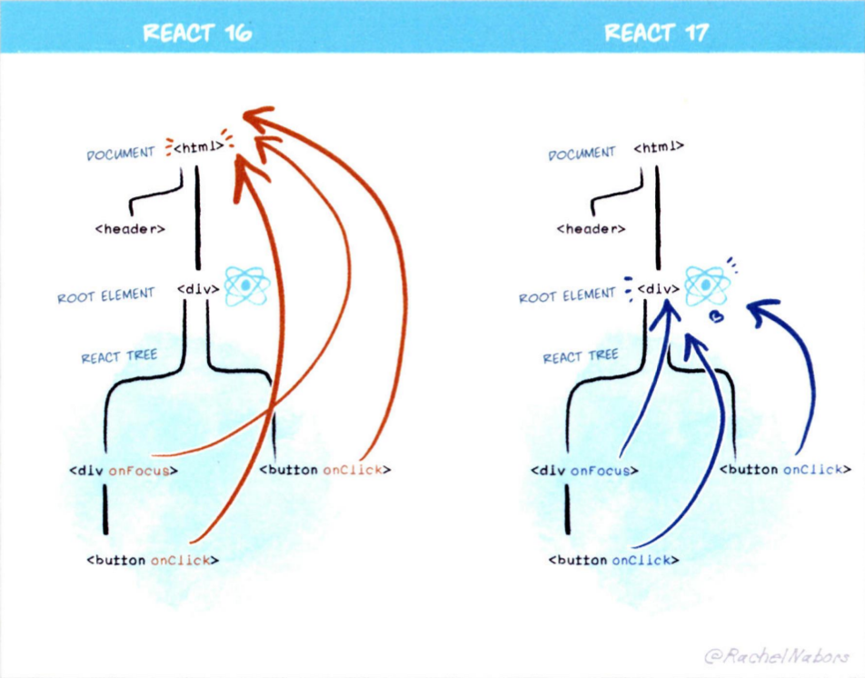
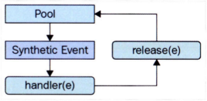

# 10장 리액트 17과 18의 변경 사항 살펴보기

# 10.1 리액트 17 버전 살펴보기

17 버전에서 새롭게 추가된 기능은 없습니다. 다만 기존에 사용하던 코드의 수정을 필요로 하는 변경 사항을 최소화한 것이 특징입니다.

## 10.1.1 리액트의 점진적인 업그레이드

리액트는 semantic version에 따라 기존 버전에서 더 이상 호환되지 않는 API가 있을 땐 주 버전 업데이트를 실시하곤 했습니다.

하지만 17 버전부터는 점진적인 업그레이드를 지원합니다. 이는 18 버전으로 업그레이드할 때 전체 애플리케이션 트리는 17 버전이지만, 일부 트리나 컴포넌트에 대해서는 18 버전을 선택할 수 있다는 것을 의미합니다. 이는 두 버전을 동시에 관리해야 한다는 부담이 있지만, 버전을 올리기에는 너무 부담이 되는 큰 애플리케이션의 경우에는 고려해 볼 만한 선택지가 될 수 있습니다.

예를 들어 상위 버전에서 하위 버전의 컴포넌트를 불러오려면 하위 버전의 리액트를 lazy하게 불러올 수 있습니다. 하지만, 리액트 팀에서는 어디까지나 차선책으로써 소개하고 있으며 버전을 한꺼번에 올리는 것이 복잡성 감소 측면에서 좋다고 언급하고 있습니다.

## 10.1.2 이벤트 위임 방식의 변경

16 버전에선 이벤트 위임이 모두 `document`에서 수행되고 있었습니다. 17 버전부터는 이벤트 위임이 리액트 컴포넌트 최상단 트리, 즉 루트 요소로 바뀌었습니다.

이유는 점진적인 업그레이드 지원과 다른 바닐라 JS 코드 또는 jQuery 등이 혼재돼 있는 경우 혼란을 방지하기 위해서입니다. `document`에 부착된 이벤트는 하위 컴포넌트에서 `e.stopPropagation`을 실행하더라도 이미 `document`에 부착된 이벤트는 막을 수 없으므로 상위 컴포넌트로 전파되는 문제가 발생했습니다.



## 10.1.3 새로운 JSX transform

JSX는 바벨이나 TS를 활용해 JSX를 JS로 변환해야 했지만 17 버전부터 바벨과 협력해 `import` 구문 없이도 JSX를 변환할 수 있게 됐습니다. 그러면서 `import React from 'react'` 구문이 없어도 JSX로 변환됩니다.

> `npx react-codemod update-react-imports` 명령어를 통해 기존의 `import React`를 삭제할 수 있습니다.

업데이트된 방식은 이전에 비해 코드가 간결해졌을 뿐만 아니라, 17 버전의 `react/jsx-runtime`의 `jsx` 쪽이 훨씬 더 간결한 내부 로직을 가지고 있습니다. 또한 번들 사이즈가 조금이나마 줄어든다는 이점도 있습니다.

## 10.1.4 그 밖의 주요 변경 사항

### 이벤트 풀링 제거

16 버전에서는 이벤트 풀링이라는 기능이 있었습니다. 이벤트를 처리하기 위한 `SyntheticEvent`라는 이벤트는 브라우저의 기본 이벤트를 한 번 더 감싼 이벤트 객체입니다. 이벤트가 발생할 때마다 이 이벤트를 새로 만들어야 했고, 그 과정에서 항상 새로 이벤트를 만들 때 메모리 할당 작업이 일어났고, 메모리 누수 방지를 위해 주기적으로 해제해야 하는 번거로움도 있었습니다.

이벤트 풀링이란 `SyntheticEvent` 풀을 만들어서 이벤트가 발생할 때마다 가져오는 것을 의미합니다.



이벤트 풀링 시스템 과정은 다음과 같습니다.

1. 이벤트 핸들러가 이벤트 발생
2. 풀에서 합성 이벤트 객체에 대한 참조를 가져옴
3. 이 이벤트 정보를 합성 이벤트 객체에 삽입
4. 유저가 지정한 이벤트 리스너 실행
5. 이벤트 객체가 초기화되고 및 이벤트 풀로 돌어감

16 이하 버전에서는 한번 이벤트 핸들러를 호출한 `SyntheticEvent`는 이후 재사용을 위해 `null`로 초기화됩니다. 따라서 비동기 코드 내부에서 `SyntheticEvent`인 `e`에 접근하면 이미 사용되고 초기화된 이후기 때문에 `null`만 반환됩니다. 때문에 `e.persist`같은 메서드를 사용해야 했습니다.

### 🤔 핸들러가 발생시킨 이벤트는 무조건 `SyntheticEvent`로 래핑되는가?

React의 핸들러가 받는 이벤트는 기본적으로 모두 `SyntheticEvent`로 래핑됩니다.
React의 이벤트 시스템은 **브라우저의 이벤트를 `SyntheticEvent`로 감싸서 일관된 인터페이스를 제공**합니다. 이 덕분에 브라우저 간 차이를 줄일 수 있습니다.

🔍 예외는 없을까?
대부분의 경우 예외는 없습니다. 하지만 몇 가지 특별한 경우를 알아두면 좋습니다:

1. React DOM 트리 밖에서 발생한 이벤트
   React가 관여하지 않는 DOM 요소에 수동으로 이벤트를 붙이면 SyntheticEvent가 아닙니다.

```tsx
useEffect(() => {
  document.body.addEventListener("click", (e) => {
    console.log(e instanceof SyntheticEvent); // ❌ false
  });
}, []);
```

2. Ref로 직접 DOM에 접근한 경우
   ref.current.addEventListener로 등록한 이벤트도 역시 원본 DOM 이벤트를 받습니다.
3. React Native
   React Native는 브라우저 환경이 아니므로 SyntheticEvent 시스템도 다르게 동작합니다. (하지만 유사한 추상화를 제공합니다.)

비동기 코드로 이벤트 핸들러에 접근하기 위해서는 별도 메모리 공간에 합성 이벤트 객체를 할당해야 한다는 점, 모던 브라우저에서 성능 향상에 크게 도움이 안 된다는 점 때문에 이벤트 풀링 개념은 삭제되었습니다.

### useEffect 클린업 함수의 비동기 실행

16 버전까지 useEffect의 클린업 함수는 동기적으로 처리되며 클린업 함수 실행 전까진 다른 작업을 블로킹하므로 불필요한 성능 저하로 이어지곤 했습니다. 17 버전부터는 화면이 완전히 업데이트된 후 클린업 함수가 비동기적으로 실행됩니다. 이는 클린업 함수가 컴포넌트의 커밋 단계가 완료될 때까지 지연된다는 것을 의미합니다. 이로 인해 리액트 커밋 단계가 효율적으로 변경되었습니다.

### 컴포넌트의 undefined 반환에 대한 일관적인 처리

16 버전에서 `forwardRef`나 `memo`에서 `undefined`를 반환하는 경우 에러가 발생하지 않았으나 17 버전부터 에러가 발생하도록 변경되었습니다.

# 10.2 리액트 18 버전 살펴보기

18 버전에서는 17 버전과 다르게 다양한 기능이 추가되었습니다. 그중 가장 큰 변경점은 바로 **동시성 지원**입니다.

## 10.2.1 새로 추가된 훅

### useId

컴포넌트별로 유니크한 값을 생성하는 훅입니다. 클라이언트와 서버상의 값의 불일치를 피하면서 컴포넌트 내부의 고유한 값을 생성할 수 있게 해줍니다. 이를 통해 하이드레이션 이슈를 방지할 수 있습니다.

### useTransition

UI 변경을 가로막지 않고 상태를 업데이트할 수 있는 훅입니다.

```tsx
import { useState, useTransition } from "react";
// ...

export default function TabContainer() {
  const [isPending, startTransition] = useTransition();
  const [tab, setTab] = useState<Tab>("about");

  function selectTab(nextTab: Tab) {
    startTransition(() => {
      setTab(nextTab);
    });
  }

  return (
    <>
      {/* ... */}
      {isPending ? (
        "로딩 중"
      ) : (
        <>
          {tab === "about" && <About />}
          {tab === "posts" && <Posts />}
          {tab === "contact" && <Contact />}
        </>
      )}
    </>
  );
}
```

위 예제와 같이 사용하게 되면, 탭과 탭 사이에 이전의 렌더링이 완전히 완료되지 않은 상태에서도 다음 렌더링이 블로킹되지 않습니다.

리액트에서 '동시성'을 다루는 훅입니다.

> 💡 리액트에서 '동시성'이란? 렌더링이 다른 렌더링을 블로킹하지 않도록 하고, 즉시 취소되거나 우선순위를 조정할 수 있게 하여, 사용자 경험을 자연스럽게 개선하는 개념

컴포넌트에서만 사용 가능하며 단순히 `startTransition`을 `import`할 수도 있습니다.

사용할 때의 주의할 점은 다음과 같습니다.

- `startTransition` 내부는 반드시 `setState`와 같은 상태를 업데이트하는 함수와 관련된 작업만 넘길 수 있다. 만약 props나 사용자 정의 훅에서 반환하는 값 등을 사용하고 싶다면 뒤에서 설명할 `useDeferredValue`를 사용하면 된다.

- `startTransition`으로 넘겨주는 상태 업데이트는 다른 모든 동기 상태 업데이트로 인해 실행이 지연될 수 있다. 예를 들어, 타이핑으로 인해 `setState`가 일어나는 경우 타이핑이 끝날 때까지 `useTransition`으로 지연시킨 상태 업데이트는 일어나지 않는다.

- `startTransition`으로 넘겨주는 함수는 반드시 동기 함수여야 한다. 만약 이 안에 `setTimeout`과 같은 비동기 함수를 넣으면 제대로 작동하지 않게 된다. 이는 `startTransition`이 작업을 지연시키는 작업과 비동기로 함수가 실행되는 작업 사이에 불일치가 일어나기 때문이다.

### useDeferredValue

리액트 컴포넌트 트리에서 리렌더링 급하지 않은 부분을 지연할 수 있게 하는 훅입니다.

디바운스와 비슷하지만, `useDeferredValue`는 고정된 지연 시간 없이 첫 번째 렌더링이 완료된 이후에 `useDeferredValue`로 지연된 렌더링을 수행합니다. 이 지연된 렌더링은 중단할 수도 있으며, 사용자의 인터랙션을 차단하지도 않습니다.

`useTransition`과의 차이점은 `useTransition`은 상태를 업데이트하는 함수를 감싸지만 `useDeferredValue`는 상태 값 자체만을 감싸서 사용한다는 점입니다. 실제로는 모두 동일한 역할을 수행합니다.

### useSyncExternalStore

17 버전의 `useSubscription`의 구현이 대체된 훅입니다. 테어링 현상을 방지하기 위해 존재하는 훅입니다.

> 테어링(tearing): 리액트에서 하나의 상태 값이 있음에도 서로 다른 값(보통 상태나 props의 이전과 이후)으로 기준으로 렌더링되는 현상

18 버전에서 동시성 모드를 지원하게 되면서 동시성 이슈가 생겨날 가능성이 있게 되었습니다. 리액트 내부에서 `useState`나 `useReducer`가 아닌 외부 데이터 소스(`document.body`, `window.innerWidth`, DOM, 외부 상태 관리 라이브러리 등)에 의해 테어링이 발생할 수 있습니다.

```js
import { useSyncExternalStore } from "react";

// useSyncExternalStore(
//   subscribe: (callback) => Unsubscribe
//   getSnapshot: () => State
// ) => State
```

- 첫 번째 인수는 subscribe로, 콜백 함수를 받아 스토어에 등록하는 용도로 사용된다. 스토어에 있는 값이 변경되면 이 콜백이 호출돼야 한다. 그리고 `useSyncExternalStore`는 이 훅을 사용하는 컴포넌트를 리렌더링한다.

- 두 번째 인수는 컴포넌트에 필요한 현재 스토어의 데이터를 반환하는 함수다. 이 함수는 스토어가 변경되지 않았다면 매번 함수를 호출할 때마다 동일한 값을 반환해야 한다. 스토어에서 값이 변경됐다면 이 값을 이전 값과 `Object.is`로 비교해 정말로 값이 변경됐다면 컴포넌트를 리렌더링한다.

- 마지막 인수는 옵션별 값으로, 서버 사이드 렌더링 시에 내부 리액트를 하이드레이션 하는 도중에만 사용된다. 서버 사이드에서 렌더링되는 훅이라면 반드시 이 값을 넘겨줘야 하며, 클라이언트의 값과 불일치가 발생할 경우 오류가 발생한다.

### useInsertionEffect

CSS-in-js 라이브러리를 위한 훅입니다. DOM이 실제로 변경되기 전에 동기적으로 실행됩니다. 훅 내부에 스타일을 삽입하는 코드를 넣어 브라우저가 레이아웃을 계산하기 전에 실행될 수 있게끔 해서 자연스러운 스타일 삽입을 가능하게 합니다.

실제 애플리케이션 코드를 작성할 땐 사용될 일이 거의 없으므로 참고만 하는 것이 좋습니다.

## 10.2.2 react-dom/client

### createRoot

기존 `react-dom`의 `render` 메서드를 대체하는 새로운 메서드입니다. `createRoot`와 `render`를 함께 사용해야 합니다.

```js
const container = document.getElementById("root");
const root = ReactDOM.createRoot(container);
root.render(<App />);
```

### hydrateRoot

이전의 `hydrate` 메서드를 대체하는 새로운 메서드입니다.

두 API는 에러 로깅을 위한 옵션인 `onRecoverableError`를 인수로 받습니다. 이 옵션은 리액트가 렌더링 또는 하이드레이션 과정에서 에러가 발생했을 때 실행하는 콜백 함수입니다.

## 10.2.3 react-dom/server

### renderToPipeableStream

리액트 컴포넌트를 HTML로 렌더링하는 메서드입니다. HTML을 점진적으로 렌더링하며 클라이언트에서는 중간에 `script`를 삽입하는 등의 작업을 할 수 있습니다. 서버에서는 `Suspense`를 사용해 빠르게 렌더링이 필요한 부분을 렌더링하고 비싼 연산으로 구성된 부분은 이후에 렌더링할 수 있습니다.

기존 `renderToNodeStream`은 무조건 순서대로 렌더링을 진행하고 이후 렌더링은 블로킹이 걸립니다. 그러나 `renderToPipeableStream`은 순서나 오래 걸리는 렌더링에 영향을 받지 않고 빠르게 렌더링을 수행할 수 있습니다.

### renderToReadableStream

`renderToPipeableStream`이 Node.js 환경에서의 렌더링에 사용된다면 `renderToReadableStream`은 웹 스트림(web stream) 을 기반으로 작동합니다. 이는 서버 환경이 아닌 클라우드플레어나 디노 같은 웹 스트림을 사용하는 모던 엣지 런타임 환경에서 사용되는 메서드입니다.

## 10.2.4 자동 배치(Automatic Batching)

자동 배치는 리액트가 여러 상태 업데이트를 하나의 리렌더링으로 묶어서 성능을 향상시키는 방법입니다.

과거 버전에서도 이벤트 핸들러 내부에서는 자동 배치가 이뤄졌지만, 프로미스나 `setTimeout` 같은 비동기 이벤트에서는 자동 배치가 이뤄지지 않았습니다. 동기와 비동기 배치 작업에 일관성이 없었던 점을 `createRoot`를 사용하면 모든 업데이트가 배치 작업으로 최적화할 수 있게 되었습니다.

`react-dom`에서 제공하는 `flushSync`로 상태 변경 함수를 감싸면 배치로 업데이트되지 않습니다.

## 10.2.5 더 엄격해진 엄격 모드

### 리액트의 엄격 모드

리액트 컴포넌트 중 하나로 잠재적인 버그를 찾는데 도움을 줍니다. 엄격 모드가 하는 작업들은 다음과 같습니다.

1. 안전하지 않은 생명주기 메서드 사용을 경고: `componentWillMount`, `componentWillReceiveProps`, `componentWillUpdate`는 사용할 수 없게 되었습니다. 해당 메서드들을 사용하면 경고 로그를 띄웁니다.

2. 문자열 ref 사용 금지 경고: `ref`의 속성의 값으로 문자열을 할당하는 것은 권장되지 않는 사용 방식으로 경고를 띄웁니다.

3. `findDOMNode`에 대한 경고: `ReactDOM`에서 제공하는 메서드지만 권장되지 않는 방식으로 경고를 띄웁니다. `createRef`나 `useRef`를 사용하는 방향으로 전환되었습니다.

4. 구 Context API 사용 시 경고: `childContextTypes`와 `getChildContext`를 사용하면 경고를 띄웁니다.

5. 예상치 못한 부작용 검사: 부수 효과가 발생하는지 체크하기 위해 의도적으로 두 번씩 호출합니다.

- 클래스 컴포넌트의 `constructor`, `render`, `shouldComponentUpdate`, `getDerivedStateFromProps`
- 클래스 컴포넌트의 `setState`의 첫 번째 인수
- 함수 컴포넌트의 body
- `useState`, `useMemo`, `useReducer`에 전달되는 함수

18 버전에서는 리액트 컴포넌트가 마운트 해제된 상태에서도 컴포넌트 내부의 상태값을 유지할 수 있는 기능을 제공할 예정이라고 밝혔습니다. 향후 지원을 위해 엄격 모드의 개발 모드에서'만' 최초 마운트 시 모든 컴포넌트를 언마운트 후 두 번째 마운트에서 이전 상태를 복원합니다.

## 10.2.6 Suspense 기능 강화

- 아직 마운트되기 직전임에도 effect가 빠르게 실행되는 문제가 수정됐다. 이제 컴포넌트가 실제로 화면에 노출될 때 effect가 실행된다.
- `Suspense`로 인해 컴포넌트가 보이거나 사라질 때도 effect가 정상적으로 실행된다. 이전에는 컴포넌트 스스로가 `Suspense`에 의해 현재 보이는지, 숨겨져 있는지 알 방법이 없었다. 그러나 이제 `Suspense`에 의해 노출이 되면 `useLayoutEffect`의 effect(`componentDidMount`)가, 가려진다면 `useLayoutEffect`의 cleanUp(`componentWillUnmount`)이 정상적으로 실행된다.
- `Suspense`를 이제 서버에서도 실행할 수 있게 된다. 앞의 예제와 같이 `CustomSuspense`를 구현하지 않더라도 정상적으로 `Suspense`를 사용할 수 있다. 서버에서는 일단 `fallback` 상태의 트리를 클라이언트에 제공하고, 불러올 준비가 되면 자연스럽게 렌더링된다.
- `Suspense` 내에 스로틀링이 추가됐다. 화면이 너무 자주 업데이트되어 시각적으로 방해받는 것을 방지하기 위해 리액트는 다음 렌더링을 보여주기 전에 잠시 대기한다. 즉, 중첩된 `Suspense`의 `fallback`이 있다면 자동으로 스로틀링되어 최대한 자연스럽게 보여주기 위해 노력한다.

## 10.2.7 인터넷 익스플로러 지원 중단에 따른 폴리필 필요

`Promise`, `Symbol`, `Object.assign`의 세 기능을 지원하지 않는 브라우저에서 서비스한다면 폴리필을 반드시 추가해야 합니다.

## 10.2.8 그 밖의 알아두면 좋은 변경사항

- 이제 컴포넌트에서 `undefined`를 반환해도 에러가 발생하지 않는다. `undefined` 반환은 `null` 반환과 동일하게 처리된다.
- 이와 마찬가지로 `<Suspense fallback={undefined}>`도 `null`과 동일하게 처리된다.
- `renderToNodeStream`이 지원 중단됐다. 그 대신 `renderToPipeableStream`을 사용하는 것이 권장된다.
