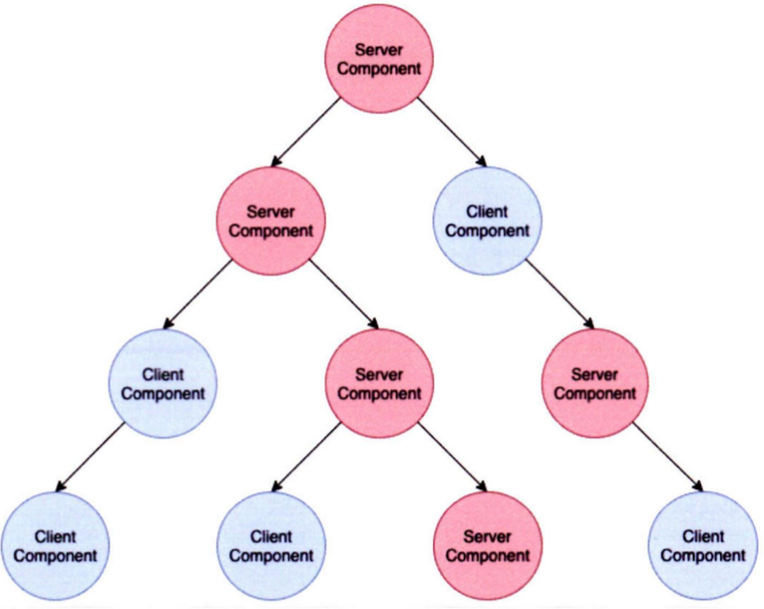

# 11장 Next.js 13과 리액트 18

Next.js 13 버전은 많은 변화가 있었습니다.

1. 리액트 18을 채택
2. 약점으로 지적되던 레이아웃 지원(?)
3. 바벨을 대체할 Rust 기반 SWC(Next.js 12 버전부터 지원), 뒤이어 웹팩을 대체할 Turbopack 출시

# 11.1 app 디렉터리

- layout.js

Next.js 12 버전까지는 공통 레이아웃을 유지하려면 `pages` 폴더의 `_app` 디렉터리를 사용해야 했습니다. (페이지 라우터) 그러나 이 방식은 각 페이지별로 서로 다른 레이아웃을 유지할 수 없었습니다.

이러한 한계를 극복하기 위해 13 버전부터 `app` 레이아웃(`app` 라우탕)을 지원하기 시작했습니다.

기존의 `/pages`로 정의하던 라우팅 방식이 `/app` 디렉터리로 이동했습니다. 또한 파일명은 라우팅에 아무 영향을 미치지 않게 되었습니다. 대신 폴더명으로 라우팅하게 됩니다.

페이지 폴더에 `layout`를 만들면 해당 주소 하위에 공통 레이아웃이 적용됩니다. `/app`의 레이아웃은 모든 페이지에 영향을 미칩니다.

서버 사이드 스타일도 `_document`에서 추가하던 방식이 루트의 `layout`에서 집어넣게끔 변경되었습니다.

- page.js

`layout.js`를 기반으로 리액트 컴포넌트를 노출합니다.

- error.js

해당 라우팅 영역에서 사용되는 공통 에러 컴포넌트입니다.

루트 에러 처리를 위해선 `app/global-error.js` 페이지를 사용할 수 있습니다.

- not-found.js

특정 라우팅 하위의 주소를 찾을 수 없는 404 페이지를 렌더링할 때 사용되는 컴포넌트입니다.

- loading.js

리액트 `Suspense`를 기반으로 한 로딩 컴포넌트입니다.

- route.js

Next.js 13.4.0 버전에서 app 라우팅을 정식으로 지원하며 `/app/api`를 기준으로 디렉터리 라우팅을 지원하며, `/api`에 대해 파일명 라우팅이 없어졌습니다. 대신 디렉터리로 라우팅 주소를 담당하며 파일명은 `route.js`로 통일되었습니다.

# 11.2 리액트 서버 컴포넌트

서버 컴포넌트는 서버 사이드 렌더링과는 다른 개념입니다.

기존 리액트 컴포넌트와 서버 사이드 렌더링의 한계로 인해 등장하게 된 개념입니다.

1. JS 번들 크기가 0인 컴포넌트는 만들 수 없음: 추가적으로 클라이언트에게 번들 다운로드를 요구
2. 백엔드 리소스에 직접 접근할 수 없음: 항상 클라이언트에서 백엔드에 접근하기 위한 방법을 마련해주어야 함
3. 자동 코드 분할이 불가능함: 항상 클라이언트 코드에서 `lazy`를 사용해야 함
4. 연쇄적으로 발생하는 클라이언트와 서버의 요청을 대응하기 어려움: 부모 컴포넌트의 요청과 렌더링이 끝나기 전까지는 하위 컴포넌트들의 서버 요청이 지연됨
5. 추상화에 드는 비용이 증가: 리액트는 템플릿 언어가 아니므로 여러 복잡한 연산의 코드를 요구됨. 이를
   서버에서 할 수는 없을까?

> 템플릿 언어: HTML에 특정 언어의 문법을 집어넣어 사용할 수 있는 것을 의미한다.

이렇게 서버 사이드 렌더링의 한계점을 즉 살펴보면 모든 문제는 리액트가 클라이언트 중심으로 돌아가기 때문에 발생하는 문제라는 것을 알 수 있습니다. 물론 과거의 전통적인 웹 애플리케이션 구축 방법, 즉 PHP나 레일즈, JSP와 같은 완전히 정적인 방식의 서버 사이드 렌더링 방식을 도입하면 이러한 문제들을 일부 해결할 수 있지만 리액트처럼 브라우저에서 고객에게 다양한 경험을 안겨주기는 어렵습니다. 성능을 위해 클라이언트의 역할을 일부 희생할 것이 좋을까요, 혹은 사용자에게 다양한 사용자 경험을 안겨주기 위해 일부 성능을 희생하더라도 클라이언트에서 다양한 작업을 처리하는 것이 좋을까요?

결국 서버 사이드 렌더링, 클라이언트 사이드 렌더링은 모두 이 문제를 해결하기에는 조금씩 아쉬움이 있습니다. 서버 사이드 렌더링은 정적 콘텐츠를 빠르게 제공하고, 서버에 있는 데이터에 손쉽게 제공할 수 있는 반면 사용자의 인터랙션에 따른 다양한 사용자 경험을 제공하긴 어렵습니다. 클라이언트 사이드 렌더링은 사용자의 인터랙션에 따라 정말 다양한 것들을 제공할 수 있지만 서버에 비해 느리고 데이터를 가져오는 것도 어렵습니다. 이러한 두 구조의 장점을 모두 취하고자 하는 것이 바로 리액트 서버 컴포넌트입니다.

## 11.2.2 서버 컴포넌트란?

서버 컴포넌트는 하나의 언어, 하나의 프레임워크, 그리고 하나의 API와 개념을 사용하면서 서버와 클라이언트 모두에서 컴포넌트를 렌더링할 수 있는 기법을 의미합니다.

일부 컴포넌트는 클라이언트에서, 일부 컴포넌트는 서버에서 렌더링됩니다. 단 클라이언트 컴포넌트는 서버 컴포넌트를 `import`할 수 없는데, 이는 클라이언트 컴포넌트가 서버 컴포넌트를 실행할 방법이 없기 때문(브라우저 환경이므로)입니다.



- 서버 컴포넌트: 상태를 가질 수 없으며, 렌더링 생명주기 또한 존재하지 않습니다. effect나 state에 의존하는 훅은 사용할 수 없습니다. Web API와 같은 브라우저 환경의 API는 사용할 수 없습니다. 서버에만 있는 데이터를 `async/await`으로 접근할 수 있습니다. 다른 서버 컴포넌트를 렌더링하거나 HTML 요소, 클라이언트 컴포넌트를 렌더링할 수 있습니다.
- 클라이언트 컴포넌트: 서버 컴포넌트를 불러오거나 서버 전용 훅을 불러올 수 없습니다. 다만 서버 컴포넌트를 자식으로 가질 수는 있습니다.
- 공용 컴포넌트(shared components): 서버와 클라이언트 모두에서 사용하는 컴포넌트로 서버와 클라이언트의 모든 제약을 받는 컴포넌트가 됩니다.

기본적으로 리액트는 모든 컴포넌트를 공용 컴포넌트로 인식하며 컴포넌트 최상단에 `'use client'`를 사용하면 명시적으로 클라이언트 컴포넌트라는 것을 선언할 수 있습니다.

서버 사이드 렌더링이나 서버 컴포넌트를 활용해 직접 개발하는 것은 아직 어려운 단계입니다. 때문에 Next.js와 같은 프레임워크와 함께 리액트 서버 컴포넌트 초기 구축을 진행하고 있습니다.

## 11.2.3 서버 사이드 렌더링과 서버 컴포넌트의 차이

서버 사이드 렌더링의 주요 목적은 빠른 초기 HTML 로딩에 있습니다. 그 이후에는 클라이언트에서 JS 코드를 다운로드, 파싱, 실행하는 비용이 듭니다.

**서버 컴포넌트를 이를 보완해줄 수 있습니다.** 서버 컴포넌트로 서버에서 렌더링할 수 있는 컴포넌트는 서버에서 렌더링하여 내려받은 다음, 클라이언트 컴포넌트는 서버 사이드 렌더링으로 초기 HTML으로 빠르게 전달받을 수 있습니다.

## 11.2.4 서버 컴포넌트는 어떻게 작동하는가?

1. 서버가 렌더링 요청을 받으면 서버 렌더링을 시작한다. (서버가 렌더링하므로 루트 컴포넌트는 항상 서버 컴포넌트)
2. 컴포넌트를 JSON으로 직렬화한다. 이떄 서버에서 렌더링할 수 있는 건 직렬화하고, 클라이언트 컴포넌트가 들어갈 공간은 플레이스홀더로 나타낸다. 브라우저는 이를 받아 다시 역직렬화한 다음 렌더링을 수행한다.
3. 브라우저가 리액트 컴포넌트 트리를 구성한다. JSON을 받으면 트리를 재구성해 컴포넌트를 만든다. 이때 클라이언트 컴포넌트를 받으면 클라이언트에서 렌더링하고 서버 결과물을 받으면 이를 기반으로 리액트 트리를 만들어서 만든 트리를 브라우저의 DOM에 커밋한다.

💡 이러한 특징으로 서버 컴포넌트에서 클라이언트 컴포넌트로 props를 넘길 때 반드시 직렬화 가능한 데이터를 넘겨야 합니다. `getServerSideProps`에서 페이지로 props를 넘길 때, JSON 직렬화 가능한 데이터를 반환해야만 하는 이유와 동일합니다.

# 11.3 Next.js에서의 리액트 서버 컴포넌트

13 버전에서 서버 컴포넌트를 도입했으며, `/app` 디렉터리에 구현돼 있습니다.

Next.js가 리액트의 서버 컴포넌트를 도입하면서 과거 `getServerSideProps`, `getStaticProps`, `getInitialProps`가 `/app` 디렉터리 내부에서 삭제되었고, `fetch`를 기반으로 이루어집니다.

Next.js는 중복된 `fetch` 요청을 서버에서 렌더링이 한 번 끝날 때까지 캐싱해두고 별도의 지시가 없는 이상 최대한 데이터를 캐싱합니다.

# 11.4 터보팩의 등장

웹팩을 대체하기 위해 Rust 기반의 빌드 도구인 터보팩이 등장했습니다. 현재는 많은 버그를 고쳤으며 꽤 안정적으로 동작하지만, 기존의 웹팩을 100% 대체하기에는 무리가 있다는 의견이 있습니다. 터보팩은 Rust로 재작성되었기 때문에 기존 JavaScript 기반의 웹팩 플러그인과 100% 호환되지 않기 때문입니다.

# 11.5 서버 액션

서버 액션을 사용하면 API를 생성하지 않더라도 함수 수준에서 서버에 직접 접근해 데이터를 요청할 수 있습니다. 14 버전부터 정식 기능으로 포함되었습니다. 별도의 설정없이 기본적으로 활성화됩니다.

```tsx
// app/page.tsx

export default function Home() {
  // 이 함수는 서버에서만 실행됩니다.
  async function createInvoice(formData: FormData) {
    "use server"; // 이 지시어가 서버 액션임을 명시합니다.

    const rawFormData = {
      amount: formData.get("amount"),
      status: formData.get("status"),
    };

    // 여기에 데이터베이스에 데이터를 저장하는 로직을 실행합니다.
    // await saveToDatabase(rawFormData);

    console.log("Invoice created on the server:", rawFormData);
  }

  return (
    // form의 action에 서버 액션 함수를 직접 연결합니다.
    <form action={createInvoice}>
      <input type="number" name="amount" />
      <select name="status">
        <option value="pending">Pending</option>
        <option value="paid">Paid</option>
      </select>
      <button type="submit">Create Invoice</button>
    </form>
  );
}
```

서버 액션을 실행하면 현재 라우트 주소와 `ACTION_ID`만 보내고 그 외에는 아무것도 실행하지 않습니다.
